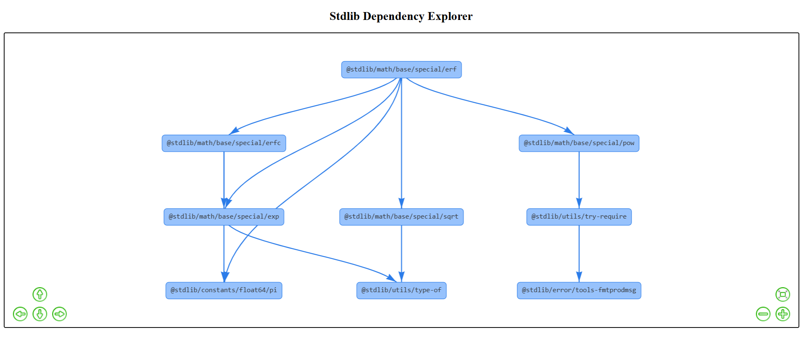

#  Stdlib Dependency Tree Mini Showcase

This project is a visual dependency explorer for a single `stdlib` package, built using **Vis.js**, **HTML**, and **JavaScript**. It demonstrates the internal dependencies of the package `@stdlib/math/base/special/erf` in an interactive graph.

## 🔍 What It Does

- Visualizes the internal dependencies of one stdlib package.
- Shows how packages are interconnected.
- Provides a mini version of the full project idea: "Stdlib API Dependency Explorer".
- Serves as a beginner-friendly visualization tool for exploring `stdlib`.

## 📸 Demo Screenshot

  

## 🚀 Tech Stack

- [Vis.js](https://visjs.org/)
- HTML, CSS, JavaScript
- Node.js (used to install `@stdlib/stdlib`)


## 🧠 How It Works

The graph is rendered using `Vis.js`, and the nodes represent individual packages used internally by `@stdlib/math/base/special/erf`.

Each node:
- Can show tooltips on hover.
- Will open it's official documentation when clicked.

> This visualization is static for now but could be dynamically generated by parsing `package.json` or by inspecting dependencies through stdlib tooling, and there is many other features that can be further integrated like color scheme, nodes collapsing, etc.

## 📦 How to Run

1. Clone the repository:
   ```bash
   git clone https://github.com/tejas-963/stdlib-dependency-tree-mini.git
   cd stdlib-dependency-tree-mini
   ```

2. Install dependencies:
   ```bash
   npm install
   ```

3. Open `index.html` in your browser.

> You can use a simple local server like:
> ```bash
> npx serve .
> # or
> python -m http.server
> ```

## 📚 What I Learned

- How to work with `@stdlib/stdlib` packages.
- How to visualize dependencies using Vis.js.
- How to structure a minimal web-based tool.

## ✨ Inspiration

This showcase is based on the [GSoC 2025 project idea](https://github.com/stdlib-js/stdlib/discussions/33) titled **"Stdlib API Dependency Explorer"**. The goal was to explore how visual tools can simplify onboarding and understanding of large codebases.